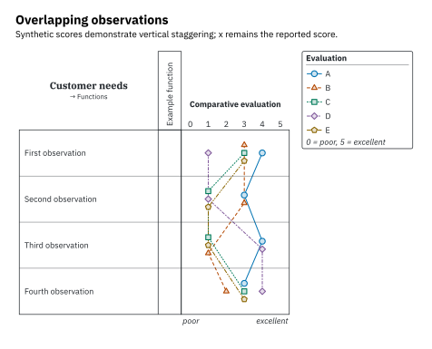

# Profile palette and revision colors

## Where the old colors came from

The previous five colors — `#0072B2`, `#D55E00`, `#009E73`, `#CC79A7`, `#56B4E9` — are a subset of the **Okabe–Ito** palette from Masataka Okabe and Kei Ito’s [Color Universal Design](https://jfly.uni-koeln.de/color/). Their guidance explicitly recommends redundant coding: colors together with shapes and line patterns. The former stroke widths, marker sizes, and lightening percentages were package choices, not part of the published color palette.

The original sky blue has approximately 2.31:1 contrast against white; its thin stroke was particularly faint at small sizes. The earlier blue appeared twice as dark/light variants, and the first line was heavier than all the others. These are chart-specific reasons to revise the styling, not evidence that the original palette is unsuitable in general.

## Current default: a custom print-oriented adaptation

The new set keeps the original blue, darkens the orange, green, and purple families, and replaces sky blue with ochre. All line and marker-outline colors have at least 4.5:1 calculated contrast against white. This measures separation from the paper, not separation between every pair of colors.

| Color | sRGB | Contrast against white | Redundant identifier |
| --- | --- | --- | --- |
| Blue | `#0072B2` | 5.19:1 | Circle · solid |
| Burnt orange | `#B34700` | 5.50:1 | Triangle · dashed |
| Deep green | `#007A59` | 5.35:1 | Square · dotted |
| Plum | `#815A9B` | 5.43:1 | Diamond · dash-dot |
| Ochre | `#8A6500` | 5.33:1 | Pentagon · dash-dot-dot |

Contrast uses linearized sRGB relative luminance: `(1.0 + 0.05) / (L + 0.05)`. It is a useful design check, not a blanket accessibility certification. The custom palette has not been independently evaluated for every color-vision condition. Keep shapes, dash patterns, and an explicit legend; inspect final-size output, particularly for dense ties or grayscale printing.

All series use 1 pt strokes and 1.1 pt marker outlines. Marker fills lighten the outline color by 80%, leaving a pale interior with a strong contour. Optical marker sizes differ by shape (5.5–7 pt), rather than by importance. More than five alternatives cycle styles: assign explicit distinctions when that could cause ambiguity. Use `emphasize: true` deliberately to bold a reference alternative’s legend label; override `thickness` explicitly to emphasize its line.

The default remains configurable per alternative:

```typst
#import "../lib.typ": qfd, qfd-palette
#qfd(
  whats: ("Easy cleaning",), hows: ("Flush the milk path",),
  matrix: ((9,),), show-roof: false,
  alternatives: (
    qfd-palette.at(0) + (label: "Manual", scores: (3,)),
    qfd-palette.at(1) + (label: "Automatic", scores: (4,)),
  ),
)
```

These scores only illustrate the API; they are not measured assessments of the milk concepts. To preserve an earlier appearance, provide explicit `color`, `thickness`, `marker-thickness`, and `fill-lighten` overrides.



## Revision colors have a different job

Pale green (`#E4F2E5`), red (`#F8E3E3`), and yellow (`#FFF2CE`) backgrounds mean added, removed, and changed data. They are custom git-style diff colors, not members of the profile palette. Dark ink and +/−/~ markers convey the same edit status. Their values live in `src/theme.typ`; categorical profile colors and strokes live in `src/palette.typ`.
